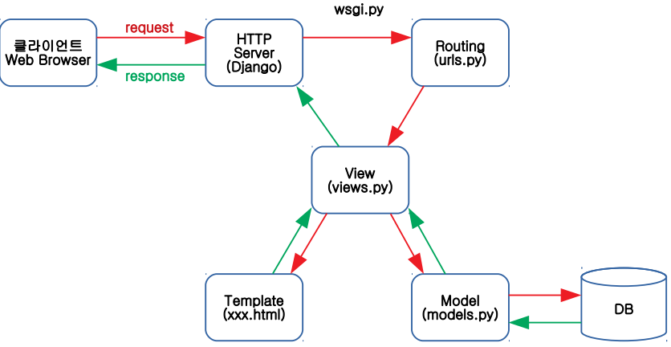
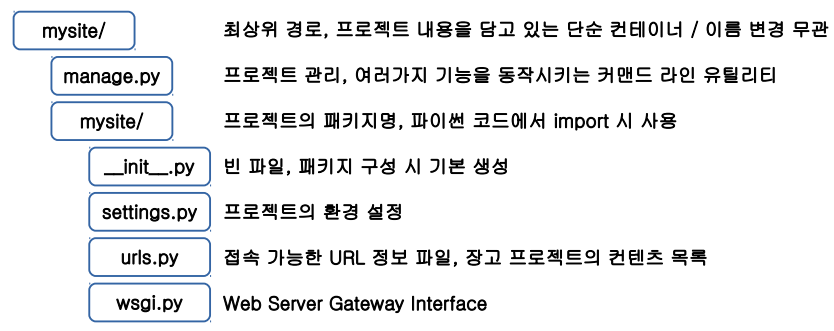
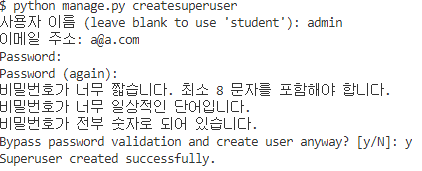

## Django

● 2003년에 Lawrence Journal-World newspaper에서 사용하기 위해 개발 

● 파이썬으로 만들어진 무료 오픈소스 웹 애플리케이션 프레임워크

● MTV 패턴 (Model, Template, View)

- Model : 데이터 처리 (DB의 테이블)
- Template : 클라이언트에게 보여줄 UI (HTML)
- View : **Controller**와 비슷한 역할, 요청을 받은 후 [모델을 실행한 후] 응답



Routing : 라우팅 파일에 실제 접속할 주소를 명시.

주소를 확인하고 그 주소를 처리할 함수나 클래스에 연결해줌. 



- setting : database 저장할 때 관여 

-  manage.py : 프로젝트 관리 
  - 프로젝트 관리에 필요한 명령어 사용 가능 
  -  runserver : 서버 실행 -
  - startapp : 앱 생성 -
  - createsuperuser : 관리자 생성 - 
  - migrate : 변경사항을 데이터베이스로 반영 
  -  makemigrations app : app의 모델 변경사항 확인 
  -  shell : 쉘을 통해 데이터 확인
  -   collectstatic : 여러개의 App 에서 사용하는 static 파일을 한 곳으로 모음


-------

설치 : django를 위해 만든 폴더에  cmd 창에 `conda install django` 라고 입력함. 

 

 

------------

1. 프로젝트 생성함 ! 

   설치 한 후 `django-admin startproject tutorial` 입력함.

   `code . ` 이라고 입력해서 vscode가 열려질수 있도록 한다. 

   vscode 앱 python  설치한다.

   

2. 처음에 App 을 만든다 .

   - control j 키 누르고 shell 에서 `python manage.py startapp firstapp`
   - `$ python manage.py runserver`
   - chrome 창에서 localhost:8000 쳐서 잘 연결되었는지 확인한다 

3. setting. py

   LANGUAGE_CODE = 'ko-kr'

   TIME_ZONE = 'Asia/Seoul'

4.  주소 생성 및 내용 연결 - tutorial/urls.py

   path 옆에에다가 써야함. 

   ```python
   from django.contrib import admin
   from django.urls import path
   from firstapp import views # index1/ 은 tutorial 에, index1 은 view에 이씩 때문. 
   urlpatterns = [
    path('admin/', admin.site.urls),
    path('index1/', views.index1),
   ]
   ```

   

4. 보여질 내용 - firstapp/views.py

   ```python
   from django.shortcuts import render
   from django.http import HttpResponse
   
   # Create your views here.
   
   def index1(request):
       return HttpResponse('<h1>Index1</h1>')
   ```

5.  first 주소를 거쳐서 가는 것을 생성해보기 . 

   firstapp 에 url 파일을 생성함. 

   urls.py \firstapp 에  다음과 같은 코드를 작성함. 

   ```python
   from django.urls import path
   from . import views #자기와 같은 경로에 있기 때문. 
   
   urlpatterns = [
    path('main/', views.main, name='main'),
   ]
   ```

   

6. 다시 url.py \tutorial 에 가서  다음과 같이 코드를 작성함. 

   ```python
   
   from django.contrib import admin
   from django.urls import path, include
   from firstapp import views 
   
   urlpatterns = [
       path('admin/', admin.site.urls),
       path('index1/', views.index1),
       path('index2/', views.index2),
       path('first/', include('firstapp.urls')), # include -> first 주소를 거쳐야만 갈 수 있음. 
   ]
   ```

   --------------------

   <연습 문제 >

프로젝트 ->second

앱 -> secondapp

url -> /second/main -> main! 출력 


----------

● 모델 - firstapp/models.py 

```python
from django.db import models
class Curriculum(models.Model):
 name = models.CharField(max_length=255)
```


 MySQL DB 설정 ● settings.py 접속 DB 환경설정

```python
DATABASES = {
     'default': {
     'ENGINE': 'django.db.backends.mysql',
     'NAME': 'django', #데이터베이스 이름이다. 없으면 만들어줘야 한다. 
     'USER': 'root',
     'PASSWORD': '1234',
     'HOST': 'localhost',
     'PORT': 3306
 }
}
```


setting.py

```python
INSTALLED_APPS = [
    'django.contrib.admin',
    'django.contrib.auth',
    'django.contrib.contenttypes',
    'django.contrib.sessions',
    'django.contrib.messages',
    'django.contrib.staticfiles',
    'firstapp', # firstapp.apps.FirstappConfig
]

```


● 모델 내용 반영 

bash 창에

 python manage.py makemigrations  입력

python manage.py migrate 입력.


heidiSQL 에서 해당 firstapp curriculum 이 나옴을 알 수 있다. 

새로운 curriculum 이라는 테이블이 만들어짐을 알 수 있다. 


-------

관리자페이지 들어가기 


$ python manage.py createsuperuser




localhost:8000/admin 들어가기 -> 관리자 홈페이지가 잘 나오면 성공 ~! 


```python
# admin.py

from django.contrib import admin
from .models import Curriculum

admin.site.register(Curriculum)
```

admin.py 에 들어가서 models .py 에 있는 Curriculum 테이블을 import 한다. 

그러면 관리자 페이지에서 curriculum 테이블을 마음껏 조종/관리할 수 있다. 


------------

템플릿 활용

firstapp 에서 templates 폴더를 새로 만든다.

templates 안에 firstapp 폴더를 새로 만든다.

새로 만든 firstapp 안에 main.html (이용할 html ) 파일을 만든다.

해당 main.html 의 사용 예시는 이렇다.

```python
<body>

    <h1>main!!!</h1>
    <hr>
    {{list}}

    <hr>
    
        <h3>{{ item.id}} / {{ item.name}}</h3>
    
</body>
```

views.py에서는

```python

def index2(request):
    return HttpResponse('<h1>Hi</h1>')

def main(request):
    list = Curriculum.objects.all() #모든 데이터 가져오기
    html = ''
    for cur in list:
        html += cur.name + '<br>'

    return render(request, 'firstapp/main.html',{'list':list}) 
```


---

<생각해볼 문제>

1. django 의 모델 기능을 활용하지 않고 pymysql 모듈활용

2. django 모델 기능 활용하는데 

   기존 테이블명과 컬럼명을 수정 

3. dajango 모델 기능 활용하는데 

기존 데이터를 새로 생성된 모델로 이관(migrate)


4. `$ python manage.py inspectdb > models.py` 를 이용해 기존의 db를 이용함.

   - setting.py 에서는 mydb로 지정함

   - 그리고 명령창에서 `$ python manage.py inspectdb > shop> models.py` 라고 함.

   - 생성된 models.py 를 기존의 models.py 로 바꿔치기함. 

   - 아래와 같은 models.py 로 입력 

   - ```python
     from django.db import models
     
     
     class Shop(models.Model):
         shop_id = models.AutoField(primary_key=True)
         shop_name = models.CharField(max_length=100, blank=True, null=True)
         shop_desc = models.CharField(max_length=100, blank=True, null=True)
         rest_date = models.CharField(max_length=100, blank=True, null=True)
         parking_info = models.CharField(max_length=100, blank=True, null=True)
         img_path = models.CharField(max_length=255, blank=True, null=True)
     
         class Meta:
             managed = False
             db_table = 'shop'
         
         def __str__(self):
             return  str(self.shop_id) + '\t' +self.shop_name + '\t'+ self.shop_desc+ '\t'+ self.rest_date+ '\t'+ self.parking_info+ '\t'+ self.img_path+'<br>'
     ```

     

admin 관리자를 들어가려면

다시 한 번 bash 창에

 python manage.py makemigrations  입력

python manage.py migrate 입력.

하면 shop 이 자동으로 admin 에서 사용할 수 있도록 넣어지게 된다.  


---------------------

2번 방법을 이용해 봅시다. 기존 db를 장고에서 원하는 이름으로 바꿔치기함. 

shop 원 데이터에서 컬럼명들을 models 에 다 씁니다. (shop_id = models.AutoField(primary_key=True)

  shop_name = models.CharField(max_length=100, blank=True, null=True)...)

장고에서 실행기능을 합니다. 

`python manage.py makemigrations`

하면 0002_shop.py 같은 파일이 생겨나게 된다. 

그리고 python manage.py migrate 함. 

django 에서는 shop.py 가 생겨났는데 빈깡통들임.

그래서 실제 데이터는 mydb 에 있기 때문에 다시 settings.py 에 들어가서 mydb로 바꿔줌.

이때 django 의 shop 과 mydb 의 shop 이름이 같아야함. 

--------------------------

### 투표 


models 만들기. 

```python
from django.db import models


class Question(models.Model):
 question_text = models.CharField(max_length=200)
 pub_date = models.DateTimeField('date published')
class Choice(models.Model):
 question = models.ForeignKey(Question, on_delete=models.CASCADE)
# 외래키를 지정할 때 클래스 자체 Question 을 불러 온다. 하나하나 컬럼명을 가지고 오지 않아도 됨. 
 choice_text = models.CharField(max_length=200)
 votes = models.IntegerField(default=0)
```


shell 에서 직접 db 수정해보자. 

shell 접속 : python manage.py shell


ORM 오브젝트와 모델을 연결해줌. 객체,클래스와 모델을 연결해줌. 

```shell
student@M150317 MINGW64 ~/python/python_Django/mysite (master)
$ python manage.py shell
Python 3.7.4 (default, Aug  9 2019, 18:34:13) [MSC v.1915 64 bit (AMD64)]
Type 'copyright', 'credits' or 'license' for more information
IPython 7.11.1 -- An enhanced Interactive Python. Type '?' for help.

In [1]:  from polls.models import *

In [2]: Question.objects.all()
Out[2]: <QuerySet []> # 아직 넣은 데이터가 없어서 비어 있음. 

In [3]: from django.utils import timezone

In [4]: q = Question(question_text="What's new?", pub_date=timezone.now())

In [5]: q.save()

In [6]: q.question_text = "What's up?" #"what's new" 를 "What's up"으로 바꿈.

In [7]: q.save()

In [8]: Question.objects.all()
Out[8]: <QuerySet [<Question: Question object (1)>]>

In [9]: Question.objects.all()[0].question_text
Out[9]: "What's up?"

In [11]: data = Question.objects.get(pk=1)

In [12]: data.question_text = data.question_text + '?'

In [13]: data.save()
```


```python
In [15]: q.choice_set.create(choice_text='Not much', votes=0)
Out[15]: <Choice: Choice object (1)>

In [16]: Choice(choice_text='The sky', votes=0, question=q)
Out[16]: <Choice: Choice object (None)>

In [17]: Choice(choice_text='The sky', votes=0, question=q).save()

In [18]: q.choice_set.create(choice_text='just hacking', votes=0)
Out[18]: <Choice: Choice object (3)>


NameError: name 'c' is not defined

In [20]: c = Choice.objects.get(pk=2)

In [21]: c.choice_text
Out[21]: 'The sky'

In [22]: c.question
Out[22]: <Question: Question object (1)>

In [23]: c.question.question_text
Out[23]: "What's up??"

In [24]: q.choice_set.all()
Out[24]: <QuerySet [<Choice: Choice object (1)>, <Choice: Choice object (2)>, <Choice: Choice object (3)>]>

In [25]: q.choice_set.all().choice_set_text


```


```python
In [33]: q2 = Question(question_text="Test", pub_date=timezone.now())

In [34]: q2.save()

In [35]: q2 = Question.objects.get(pk=2)

In [36]: Choice(choice_text = 'A', votes=0, question=q2).save()

In [37]: Choice(choice_text = 'B', votes=0, question=q2).save()

In [38]: q2.choice_set.all()
Out[38]: <QuerySet [<Choice: Choice object (4)>, <Choice: Choice object (5)>]>

In [39]: c2 = Choice.objects.get(id=4)

In [40]: c2.choice_text
Out[40]: 'A'

In [41]: c2.question.question_text
Out[41]: 'Test'

    q2.choice_set.all()


```


----------



cross script . request f...?


현재 4페이지 aaa2111 (외계어 같은 것 . 티켓을 발급해줌.)

5페이지 클릭. 5페이지 요청 aaa2111 값을 같이 전송 (발급 받은 티켓을 가지고 요청)


그런데 내가 파라미터를 바꾸어서 5페이지 요청. 예 : ''~~~ page=5' 

즉, 부여 받은 값을 가지지 않고 파라미터 자체를 바꾸어서 페이지를 바꿈.

이걸 방지하기 위해 파라미터 변조 방지를 해야함 !


--------

부트스트랩 적용